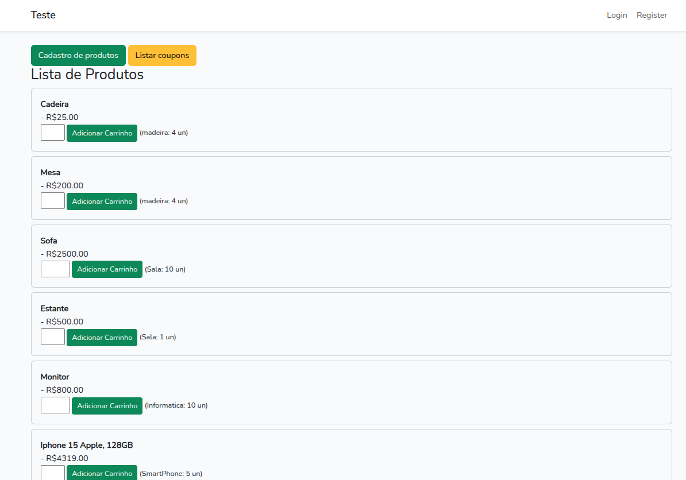

<p align="center"><a href="https://laravel.com" target="_blank"></a></p>


## ✅ TECNOLOGIAS:
- Laravel 10
- PHP8.2
- nginx
- phpmyadmin
- Bootstrap 5
- MySQL
- Session (para carrinho)
- ViaCEP API (frete)

## Start do projeto

```sh
pnpm install 
pnpm run dev 
cp .env.example .env
docker-compose up -d
docker exec -it Teste_php_fpm sh
composer install
php artisan key:generate
php artisan cache:clear && php artisan config:clear && php artisan route:clear && php artisan view:clear && php artisan optimize:clear
chmod -R gu+w storage && chmod -R guo+w storage && chmod -R 777 storage/ && chmod -R 777 storage/* bootstrap/cache/*
composer dump-autoload

```

## SQL foi exportado do phpmyadmin
`teste.sql`

<p align="center"><a href="https://github.com/lucenarenato/teste-Montink" target="_blank"></a></p>
